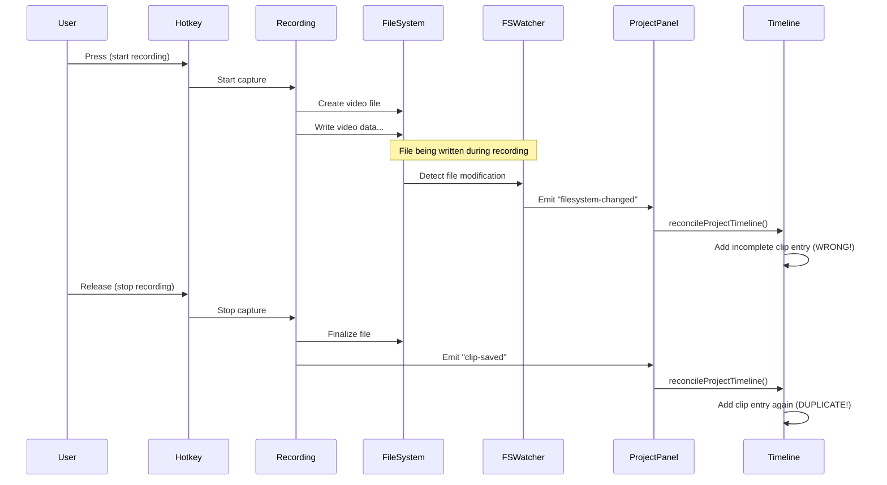

# Duplicate Timeline Entry Fix

## Problem
When recording a video, the clip was being added to the timeline twice:
1. Once when the filesystem watcher detected the new video file
2. Once when the `clip-saved` event was emitted after recording stopped

Both events triggered `handleRefresh()` in `ProjectPanel.tsx`, which called `reconcileProjectTimeline()`, causing duplicate entries.

### Additional Issue: In-Progress File Detection
For longer recordings, the filesystem watcher would detect the file **while it was still being written**, causing:
- Checksum/hash mismatches
- Incomplete file metadata
- Premature timeline entry creation

## Root Cause
The event flow was:


## Solution
**Pause filesystem watcher during recording** and only resume after `clip-saved` event is fully processed.

### Architecture Changes

#### 1. Controllable Watcher (`src-tauri/src/fs_watcher.rs`)
```rust
pub struct WatcherControl {
    enabled: Arc<AtomicBool>,
}

impl WatcherControl {
    pub fn pause(&self) {
        self.enabled.store(false, Ordering::SeqCst);
    }
    
    pub fn resume(&self) {
        self.enabled.store(true, Ordering::SeqCst);
    }
}
```

The watcher thread checks `enabled` flag before emitting events:
```rust
if !enabled_clone.load(Ordering::SeqCst) {
    println!("📂 Filesystem event received but PAUSED");
    continue;
}
```

#### 2. State Management (`src-tauri/src/state.rs`)
Added `watcher_control` field to `AppState`:
```rust
pub struct AppState {
    // ... existing fields
    pub watcher_control: Mutex<Option<WatcherControl>>,
}
```

#### 3. Hotkey Handler (`src-tauri/src/commands.rs`)

**On Recording Start (Hotkey Press):**
```rust
// Pause filesystem watcher during recording
{
    let control = state.watcher_control.lock().unwrap();
    if let Some(watcher) = control.as_ref() {
        watcher.pause();
    }
}
```

**On Recording Stop (Hotkey Release):**
```rust
// After clip is saved and event emitted
let _ = events::emit_clip_saved(&app_clone, ...);

// Resume filesystem watcher AFTER clip is fully processed
{
    let control = state.watcher_control.lock().unwrap();
    if let Some(watcher) = control.as_ref() {
        watcher.resume();
    }
}
```

**On Error:**
Always resume watcher to prevent permanent pause state.

## Why This Works

### Timeline
```
Time 0.0s: User presses hotkey
           → Watcher PAUSED ⏸️
           → Recording starts
           
Time 0.1s: File created on disk
           → Watcher receives event but suppresses it (paused)
           
Time 5.0s: File being written (in progress)
           → Watcher receives modify events but suppresses all (paused)
           
Time 10.0s: User releases hotkey
            → Recording stops
            → File finalized
            → Timeline entry added
            → clip-saved event emitted
            → Watcher RESUMED ▶️
            
Time 10.1s: External file changes now detected again ✅
```

### Benefits
- ✅ **No duplicate entries**: Only `clip-saved` triggers reconciliation
- ✅ **No incomplete file detection**: Watcher paused during write
- ✅ **No checksum issues**: File fully written before watcher sees it
- ✅ **External changes still work**: Watcher resumes after recording
- ✅ **Error-safe**: Always resumes on error paths
- ✅ **Simple state management**: Single atomic bool flag

## Testing Checklist
- [ ] Record a short clip (< 5s) → verify only ONE timeline entry
- [ ] Record a long clip (> 30s) → verify only ONE timeline entry (no in-progress detection)
- [ ] Record multiple clips rapidly → verify each appears once
- [ ] Record, then drag external video into folder → verify external file detected
- [ ] Record with error (e.g., no permissions) → verify watcher resumes
- [ ] Create new project folder while recording → verify detected after recording stops

## Alternative Solutions Considered

### 1. Time-Based Debouncing (Initially Tried, FAILED)
**Problem**: Can't distinguish between:
- In-progress file writes (should ignore)
- Completed external file additions (should detect)

Both look identical to filesystem watcher, so any debounce window is either:
- Too short: Allows in-progress detection ❌
- Too long: Misses external changes ❌

### 2. Checksum/Hash Verification (Rejected)
- CPU-intensive for large files
- Still requires multiple scans to detect "file done writing"
- Race conditions remain

### 3. Track Recently Saved Clips (Rejected)
- Complex state synchronization
- Need to track paths, timestamps, cleanup
- Doesn't solve in-progress write detection

### 4. Pause During Recording (✅ Chosen)
- **Simple**: Single atomic bool flag
- **Correct**: Only processes complete files
- **Reliable**: No timing-dependent logic
- **Maintainable**: Clear pause/resume semantics
- **Efficient**: No unnecessary scanning during recording

## Implementation Details

### Thread Safety
- `Arc<AtomicBool>` for lock-free cross-thread communication
- `Mutex<Option<WatcherControl>>` in AppState for safe access
- No deadlock risk: watcher control is lightweight

### Error Handling
All error paths resume the watcher:
- Recording start failure
- Recording stop failure
- File write errors

### Performance
- No performance impact during recording (watcher paused)
- No polling or periodic checks needed
- Event-driven design preserved

## Future Improvements

If needed, could add:
- Pause counter to handle nested pause/resume
- Explicit pause duration tracking for debugging
- Metrics on paused event count
