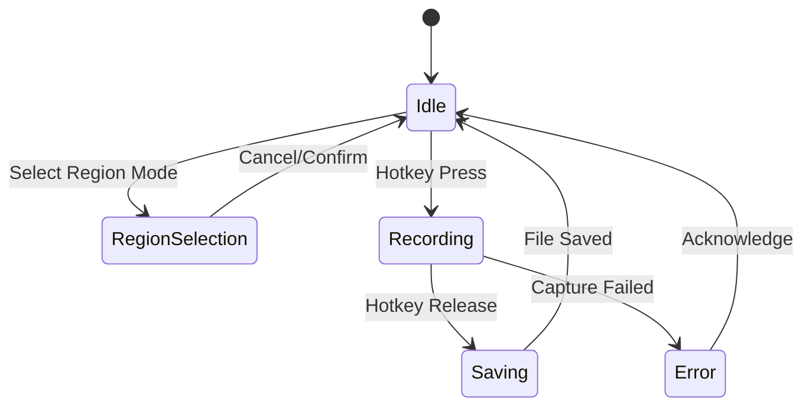

# Pulse Desktop - GitHub Copilot Instructions

## Project Overview

**Pulse Desktop** is a minimal Tauri + React desktop application for macOS and Windows that enables push-to-hold screen capture with the following capabilities:

### Core Features
- **Push-to-hold recording**: Global hotkey (Cmd+Shift+R on macOS, Ctrl+Shift+R on Windows) - hold to record, release to save
- **Flexible capture modes**: Full screen or user-defined region with aspect ratio presets
- **Aspect ratio presets**: 16:9 and 9:16 with snap-to-aspect during region selection
- **Optional scaling**: Auto-scale captured content to preset resolutions (e.g., 1920×1080 for 16:9)
- **Microphone audio**: Toggle mic recording on/off (no system audio in V0)
- **Simple output**: Files saved to `~/Movies/PushToHold` (macOS) or `~/Videos/PushToHold` (Windows) as `recording-N.mp4`

### Technology Stack
- **Frontend**: React + TypeScript + Vite
- **Desktop Framework**: Tauri (Rust backend)
- **Target Platforms**: macOS and Windows
- **Capture APIs**:
  - macOS: ScreenCaptureKit, CGEventTap for hotkeys, AVAssetWriter for encoding
  - Windows: Desktop Duplication API, SetWindowsHookEx for hotkeys, Media Foundation for encoding

### Architecture Principles
- **Minimal UI**: Single screen with essential controls only
- **Native module bridge**: Rust backend exposes capture/recording APIs to React frontend
- **Event-driven**: Status updates via events (`idle|recording`, `clipSaved`, `error`)
- **V0 Scope**: Focus on core recording functionality, defer advanced features

## Project-Specific Guidelines

### Tauri/Rust Backend
- **Keep native modules focused**: Each Rust module should handle one specific responsibility (hotkeys, capture, encoding)
- **Platform abstraction**: Use conditional compilation (`#[cfg(target_os = "macos")]`) to separate platform-specific code
- **Error handling**: Always propagate errors to frontend with clear error codes and messages
- **Performance**: Recording operations must not block the main thread; use async where appropriate
- **Memory safety**: Ensure proper cleanup of capture sessions and file handles

### React Frontend
- **Component organization**: Separate UI components from business logic
- **State management**: Use React hooks for local state, context for global app state
- **Real-time updates**: Display recording status, clip count, and errors immediately via event listeners
- **Visual feedback**: Provide clear indicators for recording state (idle vs active)
- **Region overlay**: Keep overlay implementation separate from main app component

### Recording & Capture
- **File naming**: Sequential numbering (`recording-1.mp4`, `recording-2.mp4`...)
- **Hold duration accuracy**: ±150ms tolerance for recording duration vs hold time
- **Debounce hotkeys**: Prevent auto-repeat key events from triggering multiple recordings
- **Aspect ratio snapping**: Smooth, responsive snapping during region selection
- **Resolution calculation**: Show computed output resolution when scale-to-preset is enabled

### Testing Priorities
1. Hotkey registration and handling across different foreground applications
2. Region selection with aspect ratio snapping (16:9 and 9:16)
3. Scale-to-preset ON/OFF behavior
4. File output verification (duration, codec, playability)
5. Microphone toggle functionality
6. Cross-platform consistency (macOS & Windows)

### Non-Goals (V0)
- System audio capture
- Multi-monitor selection UI
- Live preview during recording
- Timeline editing or post-processing
- Persistent numbering across app sessions
- Cloud upload or sharing features

## Code Quality Principles

### 🎯 DRY (Don't Repeat Yourself)
- **Never duplicate code**: If you find yourself copying code, extract it into a reusable function
- **Single source of truth**: Each piece of knowledge should have one authoritative representation
- **Refactor mercilessly**: When you see duplication, eliminate it immediately
- **Shared utilities**: Common patterns should be abstracted into utility functions

### 💋 KISS (Keep It Simple, Stupid)
- **Simple solutions**: Prefer the simplest solution that works
- **Avoid over-engineering**: Don't add complexity for hypothetical future needs
- **Clear naming**: Functions and variables should be self-documenting
- **Small functions**: Break down complex functions into smaller, focused ones
- **Readable code**: Code should be obvious to understand at first glance

### 🧹 Folder Philosophy
- **Clear purpose**: Every folder should have a main thing that anchors its contents.
- **No junk drawers**: Don’t leave loose files without context or explanation.
- **Explain relationships**: If it’s not elegantly obvious how files fit together, add a README or note.
- **Immediate clarity**: Opening a folder should make its organizing principle clear at a glance.

### 🔄 Refactoring Guidelines
- **Continuous improvement**: Refactor as you work, not as a separate task
- **Safe refactoring**: Always run tests before and after refactoring
- **Incremental changes**: Make small, safe changes rather than large rewrites
- **Preserve behavior**: Refactoring should not change external behavior
- **Code reviews**: All refactoring should be reviewed for correctness

### ⚰️ Dead Code Management
- **Immediate removal**: Delete unused code immediately when identified
- **Historical preservation**: Move significant dead code to `.attic/` directory with context
- **Documentation**: Include comments explaining why code was moved to attic
- **Regular cleanup**: Review and clean attic directory periodically
- **No accumulation**: Don't let dead code accumulate in active codebase

## Accessibility (ARIA Labeling)

### 🎯 Interactive Elements
- **All interactive elements** (buttons, links, forms, dialogs) must include appropriate ARIA roles and labels
- **Use ARIA attributes**: Implement aria-label, aria-labelledby, and aria-describedby to provide clear, descriptive information for screen readers
- **Semantic HTML**: Use semantic HTML wherever possible to enhance accessibility

### 📢 Dynamic Content
- **Announce updates**: Ensure all dynamic content updates (modals, alerts, notifications) are announced to assistive technologies using aria-live regions
- **Maintain tab order**: Maintain logical tab order and keyboard navigation for all features
- **Visible focus**: Provide visible focus indicators for all interactive elements

## Internationalization (I18N)

### 🌍 Text and Language Support
- **Externalize text**: All user-facing text must be externalized for translation
- **Multiple languages**: Support multiple languages, including right-to-left (RTL) languages such as Arabic and Hebrew
- **Language selector**: Provide a language selector for users to choose their preferred language

### 🕐 Localization
- **Format localization**: Ensure date, time, number, and currency formats are localized based on user settings
- **UI compatibility**: Test UI layouts for text expansion and RTL compatibility
- **Unicode support**: Use Unicode throughout to support international character sets

## Documentation Preferences

### Diagrams and Visual Documentation
- **Always use Mermaid diagrams** instead of ASCII art for workflow diagrams, architecture diagrams, and flowcharts
- **Use memorable names** instead of single letters in diagrams (e.g., `Engine`, `Auth`, `Server` instead of `A`, `B`, `C`)
- Use appropriate Mermaid diagram types:
  - `graph TB` or `graph LR` for workflow architectures 
  - `flowchart TD` for process flows
  - `sequenceDiagram` for API interactions
  - `gitgraph` for branch/release strategies
- Include styling with `classDef` for better visual hierarchy
- Add descriptive comments and emojis sparingly for clarity

### Documentation Standards
- Keep documentation DRY (Don't Repeat Yourself) - reference other docs instead of duplicating
- Use clear cross-references between related documentation files
- Update the main architecture document when workflow structure changes

## Working with GitHub Actions Workflows

### Development Philosophy
- **Script-first approach**: All workflows should call scripts that can be run locally
- **Local development parity**: Developers should be able to run the exact same commands locally as CI runs
- **Simple workflows**: GitHub Actions should be thin wrappers around scripts, not contain complex logic
- **Easy debugging**: When CI fails, developers can reproduce the issue locally by running the same script

## Pulse Desktop Quick Reference

### Key File Locations
- **Frontend entry**: `src/main.tsx` - React app initialization
- **Main component**: `src/App.tsx` - Primary UI component
- **Rust backend**: `src-tauri/src/` - Native modules and Tauri commands
- **Config**: `src-tauri/tauri.conf.json` - Tauri configuration
- **Build config**: `vite.config.ts` - Frontend build configuration

### Common Tasks
- **Add a Tauri command**: Define in `src-tauri/src/lib.rs`, expose via `#[tauri::command]`, invoke from React
- **Handle recording events**: Use Tauri's event system to emit status updates from Rust to React
- **Platform-specific code**: Use `#[cfg(target_os = "macos")]` or `#[cfg(target_os = "windows")]`
- **Global hotkey**: Register in Rust native module, trigger recording state machine
- **Region overlay**: Implement as separate React component with portal/absolute positioning

### Recording State Machine


### Aspect Ratio Presets
- **16:9 Landscape**: 1920×1080, 2560×1440, 3840×2160
- **9:16 Portrait**: 1080×1920, 1440×2560, 2160×3840

### File Output Structure
```
~/Movies/PushToHold/          (macOS)
~/Videos/PushToHold/          (Windows)
├── recording-1.mp4
├── recording-2.mp4
└── recording-N.mp4
```

### Development Checklist (Pulse-Specific)
- [ ] **Hotkey works globally**: Test with different apps in foreground
- [ ] **Region snapping**: Smooth aspect ratio constraint during drag
- [ ] **Recording accuracy**: Hold duration matches file duration (±150ms)
- [ ] **File output**: Files playable, correct codec (H.264/AAC)
- [ ] **Mic toggle**: Audio present/absent based on toggle state
- [ ] **Scale calculation**: Shows correct output resolution when enabled
- [ ] **Error handling**: Clear messages for permission/capture failures
- [ ] **Platform testing**: Verify on both macOS and Windows

## Quick Reference

### Code Quality Checklist
- [ ] **DRY**: No code duplication - extracted reusable functions?
- [ ] **KISS**: Simplest solution that works?
- [ ] **Naming**: Self-documenting function/variable names?
- [ ] **Size**: Functions small and focused?
- [ ] **Dead Code**: Removed or archived appropriately?
- [ ] **Accessibility**: ARIA labels and semantic HTML implemented?
- [ ] **I18N**: User-facing text externalized for translation?

### Before Finishing
1. Run tests.
2. Check for unused code: Review imports and functions
3. Verify DRY: Look for duplicated logic
4. Simplify: Can any function be made simpler?
5. Archive/Delete: Handle any dead code appropriately
6. Accessibility: Check ARIA labels and keyboard navigation
7. I18N: Verify text externalization and RTL compatibility
