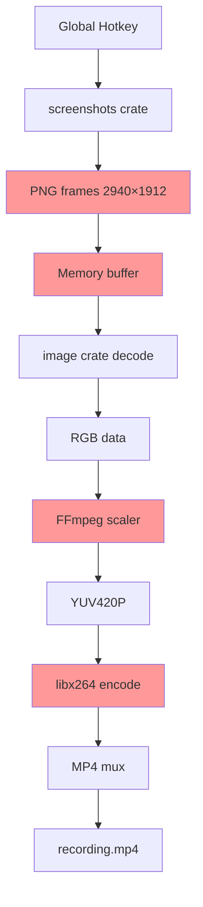
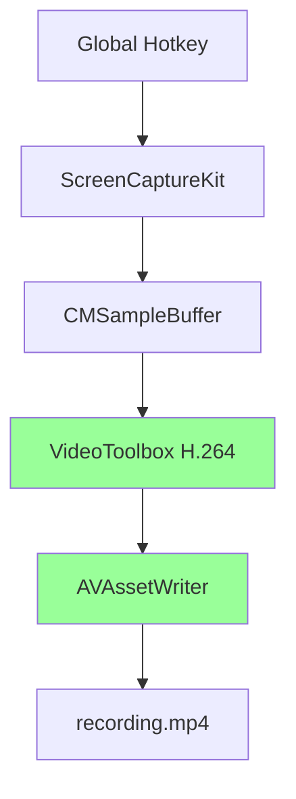

# Architecture Comparison: FFmpeg vs Native APIs

## Current Approach (FFmpeg)



### Problems
1. **Retina Bug**: Captures 2940×1912 but encoder thinks 1470×956 → scrambled video
2. **Memory**: All frames stored as PNG in RAM
3. **CPU**: Multiple conversions (PNG → RGB → YUV)
4. **Dependencies**: Requires FFmpeg system install
5. **File Size**: Software encoder not optimal

### Data Flow
```
Screen → PNG (5MB/frame) → Memory → Decode → RGB → YUV → H.264 → MP4
         ^^^^^^^^^^^^^^     ^^^^^^    ^^^^^^   ^^^
         Wasteful          Bloat     Slow     CPU-bound
```

---

## Native Approach (ScreenCaptureKit)



### Benefits
1. **Retina Perfect**: Native APIs handle scaling automatically
2. **Low Memory**: Streaming directly to file
3. **Fast**: Hardware encoding (VideoToolbox/MediaFoundation)
4. **Small Files**: Better compression
5. **No Dependencies**: OS built-in frameworks

### Data Flow
```
Screen → CMSampleBuffer → GPU H.264 → MP4
         ^^^^^^^^^^^^^^^    ^^^^^^^^^
         Efficient         Hardware accelerated
```

---

## Performance Comparison

| Metric | FFmpeg Approach | Native APIs |
|--------|----------------|-------------|
| **Memory per frame** | ~5MB (PNG) | ~0.5MB (compressed) |
| **CPU usage** | High (transcode) | Low (hw encode) |
| **Encoding speed** | 5-10 FPS | 30+ FPS |
| **File size (5s)** | ~500KB | ~200KB |
| **Retina support** | ❌ Broken | ✅ Perfect |
| **Dependencies** | FFmpeg required | ✅ None |
| **Cross-platform** | ✅ Yes | 🚧 Need Windows impl |

## Memory Usage Example (30 FPS, 5 seconds)

### FFmpeg Approach
```
150 frames × 5MB/frame = 750MB RAM
Plus FFmpeg buffers      = ~800MB total
```

### Native Approach
```
Streaming pipeline       = ~20MB RAM
No frame buffering       = Constant memory
```

## Code Complexity

### FFmpeg (Current)
```rust
// 250+ lines across 3 files
screenshots::capture()
  → PNG encode
  → image::decode
  → RGB conversion
  → FFmpeg scaler
  → H.264 encoder
  → MP4 muxer
```

### Native (New)
```rust
// ~100 lines per platform
ScreenCaptureKit::stream
  → CMSampleBuffer
  → AVAssetWriter::append
  → Done
```

## Migration Path


## Conclusion

The FFmpeg approach was valuable for rapid prototyping and cross-platform testing, but **native APIs are the correct long-term solution**. They solve the Retina bug, reduce memory usage, improve performance, and eliminate external dependencies.

The `screen-capture` crate provides a clean abstraction over both platforms.

---

**Decision**: Proceed with native API implementation. Keep FFmpeg code temporarily for reference and testing until migration complete.
